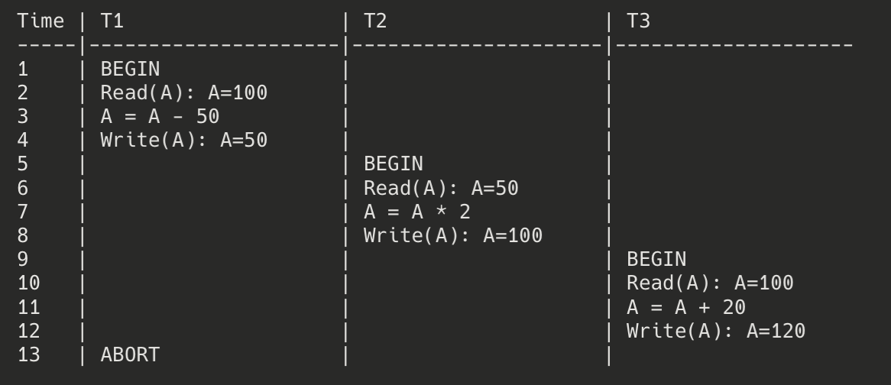

# One anomaly that a non cascadeless schedule has

## Cascading Abort Anomaly in Non-Cascadeless Schedules

The primary anomaly that a non-cascadeless schedule can have is the **Cascading Abort** problem.

### Cascading Abort Explained

**Definition**: Cascading abort occurs when the abort (rollback) of one transaction forces the system to abort other transactions that have read data written by the aborted transaction.

In a non-cascadeless schedule, transactions are allowed to read uncommitted data from other transactions. If a transaction that has written data subsequently aborts, any transaction that has read its uncommitted data must also be aborted to maintain database consistency.

### Example of Cascading Abort

Consider this schedule involving three transactions T1, T2, and T3:

This is a non-cascadeless schedule because:
- T2 reads A=50, which was written by T1 but not yet committed
- T3 reads A=100, which was written by T2 but not yet committed

When T1 aborts at step 13:
1. T1's changes must be undone (A returns to 100)
2. **T2 must also be aborted** because it read dirty data from T1
3. **T3 must also be aborted** because it read dirty data from T2 (which is being aborted)

### Why Cascading Aborts Are Problematic

1. **Efficiency Issues**: The system must keep track of dependencies between transactions, increasing overhead
2. **Domino Effect**: One aborted transaction can trigger a chain reaction of aborts
3. **Resource Waste**: Work performed by dependent transactions is wasted
4. **Unpredictability**: The system's behavior becomes less predictable as transactions may be aborted for reasons not directly related to their own operations

### How Cascadeless Schedules Solve This

In a cascadeless schedule, transactions are only allowed to read committed data. This is typically achieved by using isolation levels that prevent dirty reads (such as READ COMMITTED or higher).

For example, in the 2PL (Two-Phase Locking) protocol, a transaction would have to wait until T1 commits before reading the value of A, which prevents cascading aborts because no transaction reads uncommitted data.

This is why many database systems default to isolation levels that prevent dirty reads, as cascading aborts can significantly impact system performance and reliability.
