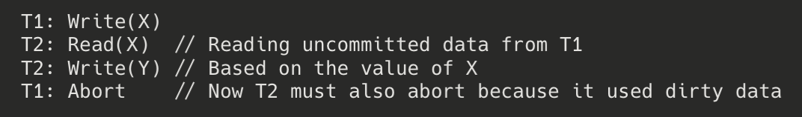
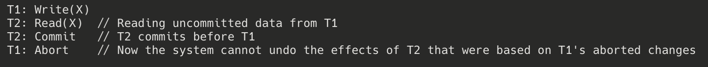
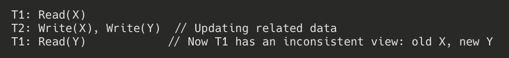
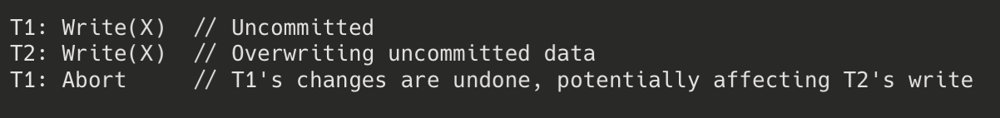

# Anomalies Solved by Strict Schedules

Strict schedules solve multiple anomalies that can occur in concurrent transaction processing. A strict schedule prevents transactions from reading or writing an item until the last transaction that wrote that item has committed or aborted. Here are the key anomalies that strict schedules solve:

## 1. Dirty Read Anomaly

**Definition**: A transaction reads data written by a concurrent uncommitted transaction.

**Example**:

**How Strict Schedules Solve It**: In a strict schedule, T2 cannot read X until T1 either commits or aborts. This prevents any transaction from reading uncommitted (potentially "dirty") data.

## 2. Cascading Abort Anomaly

**Definition**: The abort of one transaction forces the system to abort other dependent transactions that have read its uncommitted data.

**Example**:

**How Strict Schedules Solve It**: By preventing transactions from reading uncommitted data, strict schedules eliminate the dependency chain that leads to cascading aborts. If T1 aborts, no other transaction would have read its uncommitted data, so no cascading aborts are needed.

## 3. Unrecoverable Read Anomaly

**Definition**: A transaction commits after reading data from another transaction that later aborts, making recovery impossible.

**Example**:

**How Strict Schedules Solve It**: Since transactions in a strict schedule can only read committed data, the scenario where T2 reads uncommitted data from T1 cannot occur, thus eliminating the possibility of an unrecoverable read.

## 4. Inconsistent Analysis Anomaly

**Definition**: A transaction reads multiple items while they are being updated by other transactions, resulting in an inconsistent view of the database.

**Example**:

**How Strict Schedules Solve It**: Strict schedules ensure that a transaction cannot read any data item until the last transaction that wrote it has committed. This prevents the "half-updated" view that leads to inconsistent analysis.

## 5. Premature Write Anomaly

**Definition**: A transaction overwrites uncommitted data of another transaction, potentially leading to lost updates if the earlier transaction aborts.

**Example**:

**How Strict Schedules Solve It**: In a strict schedule, T2 would not be allowed to write X until T1 either commits or aborts, preventing the premature write scenario.

## Summary of Benefits

Strict schedules provide several important guarantees:

1. **Recoverability**: The database can always be recovered to a consistent state after crashes or transaction aborts.

2. **No Cascading Aborts**: The abort of one transaction never forces other transactions to abort.

3. **Consistent Database State**: Each transaction sees a consistent database state throughout its execution.

4. **Simplified Recovery**: Recovery procedures are simplified because the system only needs to undo the effects of aborted transactions, without worrying about the effects on other transactions.

Most commercial database systems implement some form of strictness through their concurrency control mechanisms (often Strict Two-Phase Locking or Snapshot Isolation) to avoid these anomalies and ensure database consistency.
