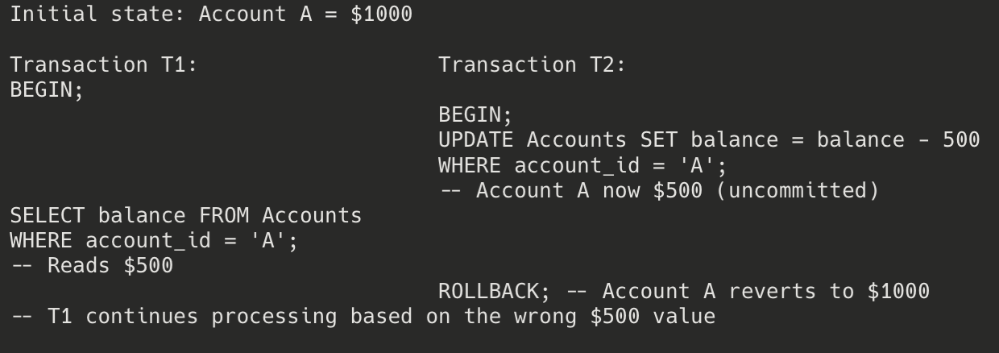
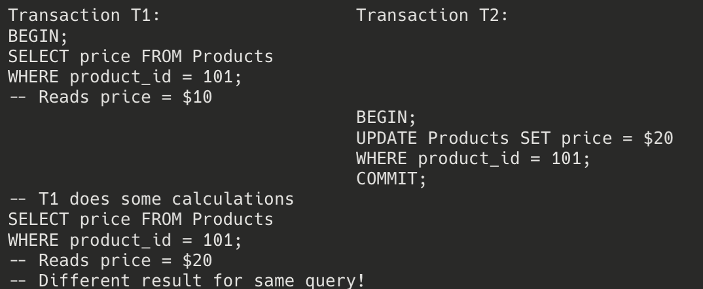
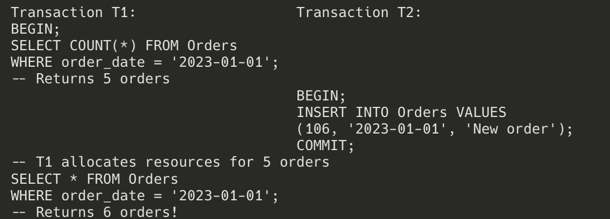
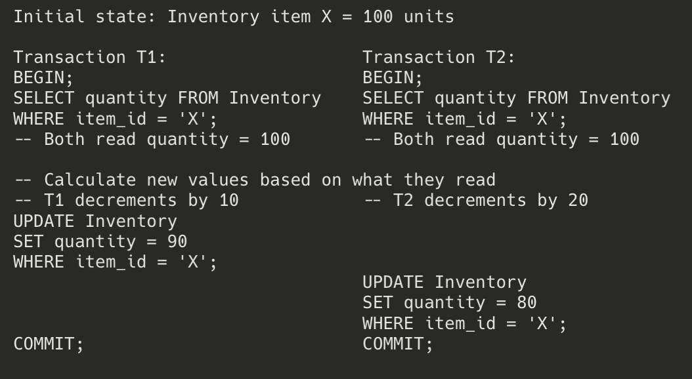
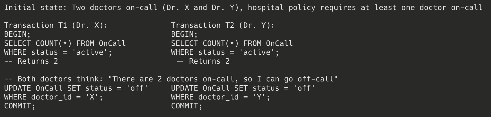
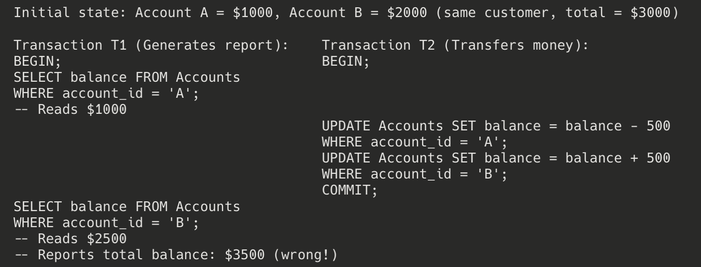

# Anomalies caused by concurrent transactions.

## Example of each, indicating why the anomalies may have made the database inconsistent.

---

## Transaction Concurrency Anomalies

Concurrent transactions can cause several types of anomalies that threaten database consistency. Here are the main ones with examples:

### 1. Dirty Read

**Definition**: A transaction reads data written by a concurrent uncommitted transaction.

**Example**:

**Consistency Issue**: T1 makes decisions based on data that was never actually committed to the database. If T2 rolls back, T1 has used a value that "never existed" from the database's perspective.

### 2. Non-repeatable Read

**Definition**: A transaction re-reads data it has previously read and finds that data has been modified by another transaction (that committed during the life of the first transaction).

**Example**:

**Consistency Issue**: T1 reads inconsistent data throughout its execution, which could lead to incorrect calculations, inappropriate decisions, or inconsistent reports.

### 3. Phantom Read

**Definition**: A transaction re-executes a query returning a set of rows that satisfy a search condition and finds that the set of rows has changed due to another recently-committed transaction.

**Example**:

**Consistency Issue**: T1's decisions about resource allocation are now incorrect. The appearance or disappearance of records that match existing criteria mid-transaction violates the isolation principle.

### 4. Lost Update

**Definition**: Two transactions select the same row and then update the row based on the value originally selected. The second update overwrites the first update without considering its changes.

**Example**:

**Final state**: Inventory item X = 80 units

**Consistency Issue**: The first update (100 → 90) is completely lost. The true final value should be 70 (100 - 10 - 20), but it's 80 because T2 overwrote T1's changes without considering them.

### 5. Write Skew

**Definition**: Two transactions read overlapping data sets, make disjoint updates, and then commit, creating an inconsistency that would not have occurred if either transaction had run by itself.

**Example**:

**Final state**: No doctors on-call! (violation of hospital policy)

**Consistency Issue**: Neither transaction by itself violates the constraint, but their combined effect does. Each transaction verified that enough doctors would remain on-call, but both made decisions based on the same outdated view of the database.

### 6. Read Skew (Inconsistent Read)

**Definition**: A transaction reads related data that is modified by another transaction while the first transaction is in progress, resulting in an inconsistent view of the data.

**Example**:

**Consistency Issue**: T1's report shows an inconsistent state that never actually existed in the database. The actual total was always $3000, but the report shows $3500 because it caught the accounts in the middle of a transfer.

These anomalies can be prevented by choosing appropriate isolation levels based on application requirements, using explicit locks, or designing transactions to minimize conflicts.