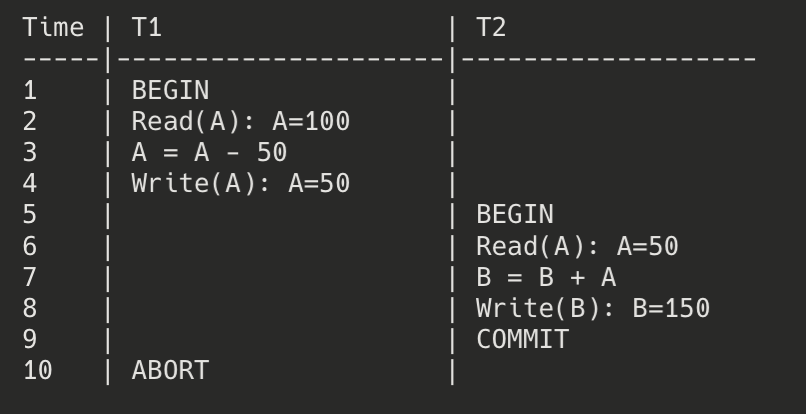

# Anomalies of a Non-Recoverable Schedule

A non-recoverable schedule has one primary anomaly that makes it problematic for database systems - the **Unrecoverable Read** anomaly. This occurs when a transaction commits after reading data from another transaction that later aborts.

## Unrecoverable Read Anomaly

**Definition**: An unrecoverable read happens when a transaction T2 reads a data item written by another transaction T1, and T2 commits before T1 commits. If T1 later aborts, the database can't be properly recovered because T2 has already committed based on data that should never have existed.

### Example of Unrecoverable Read

Consider this schedule with two transactions T1 and T2:

This schedule is non-recoverable because:
- T2 reads A=50, which was written by T1 but not yet committed
- T2 commits before T1 commits
- T1 later aborts

## Why Non-Recoverable Schedules are Problematic

1. **Violation of Atomicity**: The ACID property of atomicity is violated because the effects of a partially executed (and later aborted) transaction T1 persist in the database through the committed transaction T2.

2. **Impossible Recovery**: If the system crashes, it can't correctly recover the database state because:
   - T1's changes should be undone (rolled back) since it aborted
   - But T2's changes, which are based on T1's uncommitted data, are already permanent
   - There's no way to "selectively undo" the effects of T1 without affecting T2

3. **Data Inconsistency**: T2's computations are based on data values that, from the database's perspective, never actually existed (since T1 aborted).

## How to Prevent Non-Recoverable Schedules

To ensure recoverability, a database system must enforce one of the following constraints:

1. **Recoverable Schedules**: For any pair of transactions T1 and T2 where T2 reads data written by T1, T2 cannot commit until T1 commits. This ensures that if T1 aborts, T2 can still be aborted as well.

2. **Cascadeless Schedules** (Stronger): Transactions are only allowed to read committed data. This prevents the issue entirely since no transaction will read uncommitted data that might later be rolled back.

3. **Strict Schedules** (Even Stronger): A transaction cannot read or write an item until the last transaction that wrote that item has committed or aborted. This is commonly implemented through strict two-phase locking (Strict 2PL).

Most commercial DBMS implementations enforce at least recoverability, and many default to isolation levels that provide cascadelessness or strictness to avoid the recovery problems altogether.

The primary issue with non-recoverable schedules is that they violate the fundamental guarantee that a database system should be able to recover to a consistent state after failures, making them impractical for real-world use.
