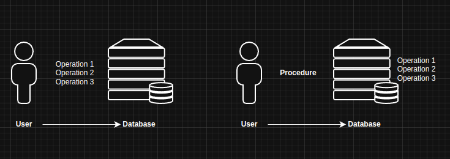

# Class Notes

## 01. Presentation and Sylabus - 17FEV2025

### Goal

- SQL language at an advanced level including SQL/PSM (stored procedures, triggers and functions)
- Base de Dados ativas
- Understand indexing mechanisms available in SGBD and design optimization strategies
- Understand and use transactional mechanisms with ACID properties realizing how they can be used to deal with cuncurrency
- Build data access layers, guaranteeing transactional control. JPA
- Develop critical thinking
- Write technical reports with discussion of different solutions, comparative analysis and critical sense

### Programme (summary)

- **M1: Transactional Processing**
    * 1. Transactional processing concepts
    * 2. Support for transactional processing in DBMSs
- **M2: Dynamic databases**
    * 3. SQL extension for programming (SQL/PSM)
    * 4. Stored procedures, functions and triggers
- **M3: Indexing and Implementation Plans**
    * 5. Know the different types of indexing structures
    * 6. Performance reports on sql commands and execution plans
- **M4: API for Data Access**
    * 7. JPA - Jakarta Persistence
    * 8. Building data access layers

### Assessment Rules

Theoretical component (CT), individual and face-to-face

- 1st test during the semester and 2nd test in the 1st
season (CT1), or
- exam (CT2);
- CT = max(CT1, CT2), Minimum grade: 10 marks.

Practical component (CP)

-  5 individual laboratory assignments carried out in class
(CR) and;
-  one project (demonstrated in class by the whole group)
and its report (CP).

**Final Grade (CF)** = 0.6 CT + 0.25 CR + 0.15 CP

Hits: 

- The student must obtain a mark of more than 8.00 and
an average of more than 9.50 in 3 of the 5 laboratory
assignments in order to get a grade;
- CT and CP are pedagogically fundamental;
- CP can be graded differently for each student;
- There is no retaking of a test during the appeal period;
- Late submissions contribute 0 (zero) to this submission;
- Groups of 3 students, with elements only from one class.

> The project delivery must include:
> - a **report in PDF**, and
> - project code (independent of the development environment).

You can download [here](https://github.com/matpato/reportisel) the Template for writing the report.
They must follow one of the versions proposed. It must not be
modified and may be penalised.

### Aditional Notes

1. The existence of situations of (self-)plagiarism in practical
work will lead to the cancellation of all work involved and
immediate fail the course unit;
2. Only work whose authors coincide with the constitution
of the groups on Moodle will be accepted;
3. Any withdrawals must be communicated to the class
teacher;
4. Submissions of work without a report will not be
considered and will be given a grade of 0 (zero);
5. The quality of the report influences the grade of the
assignment (approximately 22.5%);
6. The use of artificial intelligence tools is permitted,
provided it is indicated and used critically.

### Work environment

- Option 1: docker for postgreSQl 15.x + Java 21, any OS
- Option 2: Any OS with installed PostgreSQl 15.x + Java 21

> Only restriction: All code delivered must be executed independently of the development environment, in **command line**.
> Students **must provide the execution instructions**, assuming the existence of the JVM 21 as the only prerequisite.

### Main Bibliography

- **Fundamentals of Database System** (7th Ed) - R. Elmasri, Shamkant B. Navathe - Pearson Education (2016) - ISBN: 0-13-397077-9
- **Patterns of Enterprise Application Architecture** (5th Ed) - Martin Fowler - Addison-Wesley (2003) - ISBN: 0-321-12742-0
- **Dive Into Design Patterns** (1st Ed) - Alexander Shvets (2003) - [online](https://refactoring.guru/design-patterns)

## 02. M1 - Transactional Processing - Database Transactional Processing Concepts and Theory - 20FEV2025 e 24FEV2025

### Concurrency

- Most DBMSs are multi-user systems
- Multiple operations may act upon the same data simultaneously, this is know as multiprogramming

### Transactions

- A logical unit of database operation (eg. INSERT, DELETE, UPDATE, etc) with the goal of ensuring:
    * **atomacity** (estamos a trabalhar com uma linha ou uma tabela inteira? Tem impacto nas optimizações que vamos fazer)
    * **consistency**

- May be:
    * **read-only transactions**: does not alter any data
    * **read-write transactions**: at least one operation that alters at least one data item

- **Data granularity** - referes to the size of a data item
- Every transaction should have a unique ID 

### Transactions ACID

- **Atomacity**: all operations are applied or none is
- **Conscistency**: must take a database from one consistent state to another
- **Isolation**: should not interfere with other operations
- **Durability**: "confirmed" changes may not be lost

### Transactions - Read / Write

Without loss of generalization:

- **Read** -> read_item(X);
- **Write** -> write_item(X); (this can be a delete!)


- a) lost update problem
- b) temporary update problem
- c) incorrect summary problem


### Scheduling

- Interleaved execution of operations
- Gives us the "illusion" of concurrency
- Notation:
    * start_transaction -> b
    * write_item -> w(X)
    * read_item -> r(X)
    * commit -> c
    * abort / rollback -> a
    * end -> e

### Scheduling - Serial Execution

- Forget interleaving, simply execute then commit/abort eacgh transaction. But, it is slow...


### Scheduling - Conflicts

- When there are conflicts?
    * Two operations belongs to different transactions
    * Access the same data item
    * At least one is write

- **Read-Write Conflict**: a value is read then changed before use
- **Write-Write Conflict**: a write operation is overwritten by another 


- **Sa: r1(X); r2(X); w1(X); r1(Y); w2(X); w1(Y);**
	- 1st conflict - w1(X); w2(X); - write-write
	- 2nd conflict - r1(X); w2(X); - read-write
	- 3rd conflict - r2(X); w1(X); - read-write

### Scheduling - Recovery

- Conflicts are **recoverable** if a transaction T never has to be rolled back after commit, otherwise it is **non-recoverable**
    * so, it can't depend on another uncommitted transaction 
 


Nenhuma transacção deve depender de algo que ainda não foi committed. Só se podem ler valores que já foram committed.

### Scheduling - Cascadeless

- **Cascading rollback**: when uncommitted transactions must be rolled back due to another transaction. **This is stil recoverable**


- If there are no reads come from uncommitted transactions it is **cascadeless**

### Scheduling - Strict

- **Strict schedules**: forbids read/write of an item until the last transaction that wrote to it is committed


### Transaction States


### Log File

- Registry of (almost) all operations:
    * [start_transaction, T]
    * [write_item T, X, old_value, new_value]
    * [read_item, T, X]
    * [commit, T]
    * [abort, T]

- Sequential, append-only (used in on many distributed system databases - ex. Apache Kafka)
- Este ficheiro não é absoluto, por vezes apaga os logs antigos

### Scheduling - Correctness

- A schedule is **correct** if it preserves, the **consistency** and **isolation** of trasactions:
    * Then, **all serial schedules are correct** (but slow...)
- We want a nonsreial scehdule that is equivalent to a serlai schedule:
    * A **serailizable schedule**
- If serial schedules are correct, then a seiralizable schedule must also be correct

### Scheduling - Serial Equivalent

- Two schedules are equivalent when:
    * 1. **Result equivalence**: if they produce the same results. (**Problematic**: schedules may only be equivalent for specific values and operations....)
    * 2. **Conflict equivalence**: if the order of conflicting operations is the same
    * 3. **View equivalence**: if each read sees the same write result (view)
- There are even others, but we focus on conflict equivalence

### Scheduling - Conflict Equivalent

- Recall, operations conflicts if: (1) belong to different transactions, (2) access the same item, and (3) at least one is write
- The order matters and can lead to different results!
- We preserve the order of conflicting operations but reorder non conflicting ones
    * The resulting schedule is **conflict serializable**


### Scheduling - Wait-for-Graphs

- Also know as **precedence graphs** or **serialization graphs**
    * A **direct graph**: the flow between nods have a direction
    * It is **acyclic** if there are no loops/cycles
- If the order of conflicting operation matters, let's identify how they are chained!
- If we can build a **Direct Acyclic graph** then the schedule is serializable


---

## 03. Introduction to Transaction Processing - Conflicts and Anomalies - 24Fev2025 

### Conflict Types and the Anomalies they lead to

- **Write-Write (WW) conflict**
    * Overwriting uncommitted data
- **Read-Write (RW) conflict**
    * Dirty read
    * Incorrect summary
    * Nonrepeatable read
    * Lost update
    * Phantom read
### WW - Overwriting Uncommitted Data

- Essentially there is only one type of write/write conflict
- Similar to Lost Update issue
    * But we don't require that there is a previous read (**blind writes**)


### RW - Lost Update

- The value that T2 wrotes comes from a previous read, that is no longer up to date
- **Blind writes don't belong to this anomaly type**


### RW - Dirty Read (Temporary Update)

- A transaction fails after performing a write
- All others that read that data item will have an inconsistent view


### RW - Incorrect Summary

- Like a **dirty read** (happens even if T1 doesn't fail)
- An aggregation is interleaved with other operations
- Sometimes this not an issue
    * Eg. dashboard metrics may have soft consistency guarantees


### RW - Nonrepeatable/Unrepeatable Read

- Both reads will have distinct values, which ones was right?


### RW - Phantom Read/Insert

- A data item that was read can no longer be found, it's a **phanton record**
    * This term may also be used to refer to phantom inserts
- This may happen during searches:
    * Select all records that...
    * Followed by editing some of them

### In practice

- Achieving serializability is an hard problem in practice:
    * So we use protocols to achieve the desired effects
- If we know some transactions don't require full isolation, we may "break" isolation increase performance
    * we may also control the **access mode**
        + **Read-only** vs **Read-Write**

### Transaction in SQL

- START TRANSACTION
- SET TRANSACTION
- SET CONSTRAINTS
- SAVEPOINT (mini transactions)
- RELEASE SAVEPOINT
- COMMIT
- ROLLBACK

### Isolation Levels

- Serializable here is not the same as we seen so far!
- Specific to ensuring protection to these three types of conflicts only!

**Isolation Level - Types of Violation**

| Isolation Level | Dirty Read | Nonrepeatable Read | Phantom |
| --------------- | ---------- | ------------------ | ------- |
|READ UNCOMMITTED | Yes        | Yes                | Yes     |
| READ COMMITTED  | No | Yes | Yes |
| REPEATABLE READ | No | No | Yes |
| SERIALIZABLE    | No | No | No |

- **PostgreSQL** segue o READ COMMITED e não o SERIALIZABLE do ISO SQL99
- Em PostgreSQL, basta usar REPEATABLE READ para não termos Phantom
- PostgreSQL também pode usar SERIALIZABLE, mas faz outras funções


--- 

## 04. Intro to Transaction Processing - Pessimistic / Optimistic Concurrency - 10 e 13 Março 2025

### Pessimistic Concurrency

#### Handling Isolation Levels

- As we have seen the standard demands 3 levels of isolation
- It's responsibility of the DMS to ensure their application
    * How do they achieve this? Concurrency control protocols!

#### Concurrency Control

- Pessimistic protocols:
    * Locking protocols / Two-Phase locking
- Optimistic protocols
    * Timestamp-based
    * Multiversion
    * Validation
- Recall the importance of **granularity**, a data item could be a record, index, table, etc

#### Locking

- A concept familiar to programming and operating systems:
    * We need to prevent access to data item! Lock it!
- Locks may be of different types and granulations

#### Locks

- Generally, all data items have a lock associated
- Locks, may be:
    * **Binary**: Simple lock, unlock
    	* **To restrictive**
    * **Shared / Exclusive (Read / Write)**: allows multiple read, but a single write
    	* 3 operations / states: read_lock(ed), write_lock(ed) and unlock(ed)
- Transactions waiting for a lock are kept in a queue
- Locks may also be converted 

**Binary Locks**

```plaintext
lock_item(X):
B: if LOCK(X) == 0				(item is unlocked)
		then LOCK(X) <- 1		(lock the item)
	else
		begin
		wait 					(until LOCK(X) = 0 and the lock
								manager wakes up the transaction)
		go to B
		end.
unlock_item(X):
	LOCK(X) <- 0				(unlock the item)
	if any transaction are waiting
		then wakeup one of the waiting transactions
```

**Read / Write Locks**

```plaintext
read_lock(X)
B:	if LOCK(X) == "unlocked"
		then begin LOCK(X) <- "read-locked"
			no_of_reads(X) <- 1
			end
	else if LOCK(X) == "read-locked"
		then no_of_reads(X) <- no_of_reads(X) + 1
	else begin
		wait (until LOCK(X) == "unlocked" 
			and the lock manager wakes up the transaction)
		go to B
		end

write_lock(X)
B: if LOCK(X) == "unlocked"
		then LOCK(X) <- "write-locked"
	else begin
		wait (until LOCK(X) == "unlocked"
			and the lock manager wakes up the transaction)
		go to B
		end

unlock(X)
	if LOCK(X) == "write-locked"
		then begin LOCK(X) <- "unlocked"
			wake up one of the waiting transactions if any
			end
	else if LOCK(X) == "read-locked"
		then begin
			no_of_reads <- no_of_reads -1
			if no_of_reads == 0
				then begin LOCK(X) <- "unlocked"
					wake up one of the waiting transactions if any
					end
			end
```


#### Two-Phase Locking

- We want to divide lock management into two-phases:
	- **Expanding**: all lock acquisitions and upgrades
	- **Shrinking**: all lock releases and downgrades
- If every transaction follows the two-phase locking (2PL) protocol, then it can be said that the schedule is serializable
- We get new issues however:
	- Deadlock
	- Starvation

|  T1  |  T2  |
| ---- | ---- |
| read_lock(Y) | read_lock(X) |
| read_item(Y) | read_item(X) |
| unlock(Y) | unlock(X) |
| write_lock(X) | write_lock(Y) |
| read_item(X) | read_item(Y) |
| X := X + Y | Y := X + Y |
| write_item(X) | write_item(Y) |
| unlock(X) | unlock(Y) |


|  T1  |  T2  |
| ---- | ---- |
| read_lock(Y) |  |
| read_item(Y) |  |
| unlock(Y) |  |
|  | read_lock(X) |
|  | read_item(X) |
|  | unlock(X) |
|  | write_lock(Y) |
|  | read_item(Y) |
|  | Y := X + Y |
|  | write_item(Y) |
|  | unlock(Y) |
| write_lock(X) |  |
| read_item(X) |  |
| X := X + Y ||
| write_item(X) |  |
| unlock(X) |  |

#### Deadlocks

- At least two transactions are "stuck" waiting for locks held by each other:

|  T1  |  T2  |
| ---- | ---- |
| read_lock(Y) |  |
| read_item(Y) |  |
|    | read_lock(X) |
|    | read_item(X) |
| write_lock(X) |   |
|    | write_lock(Y) |

**Deadlock Prevention Protocols**:

- Not used in practice, inefficient:
    * Total/global ordering of data
    * Conservative 2PL
- Give a timestamp (may be a global sequential ids) to each:
    * **Wait-die** (Old waits, young dies)
        + Older transactions may wait for younger
        + Younger transactions -> rollback and restart with the same timestramp
	- **Wound-wait** (Young waits, old kills young)
		- Younger transactions may wait for longer
		- If old would wait for young -> rollback young and restart with the same timestamp
- **Waiting protocols**:
    * **No-wait**: if any lock may not be obtained -> rollback the requesting transaction
    * **Caution-waiting**: if T2 tries to acquire a lock held by T1 check whether T1 is also waiting , if yes rollback T2
    * **Timeout**: if the wait exceeds a threshold -> rollback

**Deadlock detection**:

- Wait-for-Graph are again useful
- When should we check?
    * Stopping the world to check is expensive
    * Checking with every command is also expensive
- Results in **victim selection**:
    * Choosing which transaction should be rolledback

#### Starvation

- If a **waiting protocol** is not balanced and appropriately managed, a transaction may become indefinity stuck awaiting locks
- Both **Wait-die** and **Wound-wait** can prevent starvation:
    * But a younger transaction may be more important!
- We must have fair waiting scheme:
	- Always serve transactions in "order of arrival", or
	- Have priorities but increase the priority of long waiting transactions, and
	- Increase the priority of previously rolled back transactions
	 		 

#### Two-phase locking

- So far we have talked about basic 2PL
- We also have:
    * **Conservative 2PL**: A transaction must declare all locks and acquire them, or it gets none (prevent deadlocks)
    * **Strict 2PL**: all write locks are kept until commit/abort
    * **Rigorous 2PL**: all locks are kept


### Optimistic Concurrency

#### But what is Pessimistic / Optimistic?

- Multiple views:
    * 1 (IBM view):
        + **Pessimistic** -> with locks
        + **Optimistic** -> no locks
	* 2 (that we mainly follow):
		- **Pessimistic** -> interference (wait) during transaction
		- **Optimistic** -> no interference (wait) until commit
- There are hybrid solutions and implementations that do not fit either:
    * PostgreSQl (in practice) allows transactions to keep going even if it knows a rollback will be done
    * IBM uses it's own definition of optimistic (view multiple views 1)
    * Elmasri often does not classify as optimistic/pessimistic

#### Timestamping protocols

- Strict checking and control of locks is inefficicent, particularly **if conflits are not expected to happen**
- If concurrent access to the same data item is uncommon, approaches like timestamping may achieve serializability with lower overhead
- Recall, we have already talked about timestamps to handle deadlocks and starvation
    * So are they still present? It depends...

#### Timestamps

- Each transaction must have a **unique** mark that provides order
    * For a transaction **T** this is **TS(T)**
    * Note: this may be the transaction id
- Actual clocks are't reliable in distributed systems (nor unique)!
	- So, a global counter may be used and reset periodically
	- This is the basic idea behind Lamport clock
- For non-distributed systems using just an actual timestamp may be enough, if no timestamp can be repeated
	- Same theory used to generate some unique IDs (UUID v7 - part timetamp part random)

**Timestamp Ordering Algotithm**

- Conflicting operations are ordered by the **TS(T)** of each transaction, this ensures the same order as one serial schedule
	- The schedule is conflict equivalent and therefore serializable!
- For unique **TS(T)** values the serial schedule has been chosen
- We have:
	- **read TS** -> **most recent** transaction that read a data item
	- **write TS** -> **most recent** transaction that wrote a data item 

**Basic TOA**:

- A transaction **T** can **only** change items with timestamps **older** than itself
    * Older means: write_TS > TS(T) and read_TS > TS(T)
    * If the check fails -> rollback T
        + All transactions that depend on T must also be rolled back (and so on... we have a cascading rollback)
- A transaction **T** can **only** read items **older** than itself
	- Older means: write_TS > TS(T)
	- If check fails -> same as above
- Repeat rolled back transactions with a **new** timestamp
- Update write_TS and read_TS (or keep read_TS!) as needed
- Basic TOA implies conflict serializability with no deadlocks, but with starvation and cascading rollbacks

| T1 -> TS(T1) = 1 | T2 -> TS(T2) = 2 |
| ---------------- | ---------------- |
| read(Y) |    |
|    | read(Y) |
|    | write(Y) |
| read(X) |     |
|    | read(X) |
|    | write(X) |

| Item | read_TS | write_TS |
| ---- | ------- | -------- |
| X | 2 | 2 |
| Y | 2 | 2 |

**Strict TOA**

- Any transaction that reads an item older than itself must wait until the transaction responsible for changing **write_TS** ends
- Bring back "locking" but not deadlocks
- Implies a strict and serializable schedule

**Thnoma's Write Rule**

- Changes the scheme of basic TOA by allowing "blind" writes
- If a more recent write exists ignore "our" write
- Not conflict serializable but has less write induced rollbacks

#### Multiversion Protocols

- Another approach
    * Keep multiple versions of data items and serve them
    * Each write operation creates a new version
    * Transactions may read older versions
- Causes less rollbacks at the cost of higher storage!
- Two examples:
    * Timestamped-based
    * 2PL-based

**Timestamped-based example**

- Each version has a read_TS and a write_TS
- For a transaction T:
    * write_item finds the most recent (by write_TS) version:
        + If read_TS > TS(T) or write_TS > TS(T) -> rollback
        + Otherwise create a new version with read_TS = TS(T) and write_TS = TS(T)
    + read_item finds a version such that it has max(write_TS) among the set of versions that satisfy write_TS <= TS(T):
    	+ Then, on the most recent version, update read_TS to max_(TS(T), current_read_TS)

**2PL-based (locking) example**

- Extends 2PL with a **certify lock** mode
- Two versions may be held for each item: a committed and an **optional** uncommitted version:
    * Other transactions read the uncommited version while a transaction T hnolds the write lock
    * T then upgrades all lock to **certify** ion  order to commit
- Allows read to proceed concurrent to writing operations, but may result in high waiting times to commit!
     
#### Optimistic Concurrency (Validation / certification)

- Drop **any** pre-checking to reduce overhead
- Operations are done against copies of the data items, before commit it is validated if the operations would violate serializability
    * if not -> apply the local state to the database
    * if yes -> rollback and try again
- Only efficient if there is little conflict among transactions in practice (an optimistic view)
- Has 3 phases:
    * **Read phase**: reads from commited data, but writes to local copies
    * **Validation phase**: checks for serializability and conflicts with committed and validating transactions
    * **Write phase**: applies updates or discards local state
- To aid validation write and read sets are kept associated with timestamps
- For T2 not to interfere with T1 on of these conditions must hold true: 
    * Transaction T1 completes its *write phase* before T2 starts its *read phase*
    * T2 starts its *write phase* **after** T1 completes its **write phase**, and the *read_sets* have no items in common
    * Both the *read_sets* and *write_sets* have no items in common and T1 completes its *read phase* **before** T2 completes its *read_phase*

#### Savepoints / Partial Rollbacks

- A savepoint is a "moment" where the state of a transaction was saved and may be  rolled back to, without rolling the entire transaction
- So, we have *subtransactions*

```sql
BEGIN;
	INSERT INTO table1 VALUES (1);
	SAVEPOINT my_savepoint;
	INSERT INTO table1 VALUES (2);
	SAVEPOINT my_savepoint;
	INSERT INTO table1 VALUES (3);

	-- rollback to the second savepoint
	ROLLBACK TO SAVEPOINT my_savepoint;
	SELECT * FROM table;

	-- release the second savepoint
	RELEASE SAVEPOINT my_savepoint;

	-- rollback to the first savbepoint
	ROLLBACK TO SAVEPOINT my_savepoint;
	SELECT * FROM table1;
COMMIT;
``` 

- Upon failure we may now go back to the savepoints!


#### Delayed Integrity Checks

- The **SET CONSTRAINTS** command allow to control when integrity checks are done:	
    * **IMMEDIATE**: as usual, checked for each operation
    * **DEFERED**: wait until commit
- Useful when operations may break constraints momentarily (alongside savepoints)

---

## 05. PostgreSQL Transaction Isolation - 17Mar20225

Unlike traditional aproaches PostgreSQL uses Multiversion Concurrency Control (MVCC)

- Complemented with explicit locking (table and row-level)
- A custom hybrid of 2PL and Multiversion
    * Still has locks (lots of them)
    * Offers **Seriazable Snapshot Isolation**

**MVCC**

- Popular with NoSQL/NewSQL databases
- Growing tendency even with relational databases

### Transaction Isolation - Standard vs Postgresql

#### Standard - Isolation Level vs Types of Violation

| Isolation Level | Dirty Read | Nonrepeatable Read | Phantom |
| --------------- | ---------- | ------------------ | ------- |
| READ UNCOMMITTED | Yes | Yes | Yes |
| READ COMMITTED | No | Yes | Yes |
| REPEATABLE READ | No | No | Yes |
| SERIALIZABLE | No | No | No |

#### PostgreSQL - Isolation Level vs Type of Violation

| Isolation Level | Dirty Read | Nonrepeatable Read | Phantom Read | Serialization Anomaly | 
| ------------- | ---------- | ------------------ | ------- | -- |
| READ UNCOMMITTED | Allowed but not in PG | Possible | Possible | Possible |
| READ COMMITTED | Not Possible | Possible | Possible | Possible |
| REPEATABLE READ | Not Possible | Not Possible | Allowed but not in PG | Possible |
| SERIALIZABLE | Not Possible | Not Possible | Not Possible | Not Possible |

- PostgreSQL expandiu a defenição de Isolamento, tem a mais **Seriazable Anomaly**
- Read Uncommitted em PostgreSQL o Dirty Read não acontece
- Repeatable Read em PostgreSQL, o Phantom Read não acontece

> Só se usam normalmente 2 nĩveis de isolamento, READ COMMITED e REPEATABLE READ
> SERIALIZABLE é possível mas não é muito conveniente

**Por defenição, o PostgreSQL, usa o nível de isolamento READ COMMITTED **

## 06. PostgreSQL - Multiversion Concurrency Control (MVCC) - 20MAR2025 e 24MAR2025

- Each SQL statement sees a snapshot of data (a database version) as it was some time agbo, regardless of the current state of the underlying data.
- Prevents statements from viewing inconsistent data produced by concurrent transactions, performing updates on the same data rows, providing transaction isolation  for each database session
- MVCC minimizes lock contention in order to allow for resonable performance in multiuser environments
- Advantage:
    * locks acquire for querying (reading) data, do not conflict with locks acquired for writing data, so, reading never blocks writing and writing never blocks reading - **Serializab le Snapshot Isolation (SSI)**PostgreSQL provides a means for creating locks that have application-defined meanings. These are called advisory locks, because the system does not enforce their use — it is up to the application to use them correctly. Advisory locks can be useful for locking strategies that are an awkward fit for the MVCC model. For example, a common use of advisory locks is to emulate pessimistic locking strategies typical of so-called “flat file” data management systems. While a flag stored in a table could be used for the same purpose, advisory locks are faster, avoid table bloat, and are automatically cleaned up by the server at the end of the session.


    * proper use of MVCC will generally provide better performance than locks.

| Comando | Bloq. de Leitura | Bloq. de Escrita | Outros for Share | Outros for Update |
| --- | ---- | ---- | ---- | ---- |
| SELECT | X | X | X | X | 
| SELECT FOR SHARE | X | √ | √ | X |
| SELECT FOR UPDATE | X | √ | X | √ |

### READ COMMITTED

- Default Isolation Level in PostgreSQL
- Um **snapshot por operação**
- SELECT only sees committed data before the start of the query, never sees uncommitted data or data committed by different transactions during his lifetime
- Only commited data ujp to query and his own uncommited updates (SELECT)
- UPDATE, SELECT FOR UPDATE and SELECT FOR SHARE têm o mesmo comportamento do SELECT em termos de *query for target rows*
- INSERT com ON CONFLICT DO UPDATE, comporta-se de modo semelhante
- INSERT com ON CONFLICT DO NOTHING, pode ter inserções não inseridas devido ao *outcome* de noutras transações cujos efeitos não são visiveis ao *snapshot* da transação
- A row may have been updated/deleted/locked sence the snapshot, we must wait in those cases (UPDATE/DELETE/*):
    * If only locked -> proceed
    * If rolledback -> proceed
    * If commited, does it stil match the WHERE?
        + Yes -> proceed
        + No -> nothing to commit

### REPATABLE READ

- Só vê dados commited antes do começo da transação
- Um **snapshot por transacção** at first operation
- Only committed data up to the query plus own uncommited updates (SELECT)
- When performing INSERT there will be either an INSERT or UPDATE:
    * If ON CONFLICT UPDATE an insert that conflicts with another transaction will act as an UPDATE even if the other transaction is not visible to the snapshot!
    * If ON CONFLICT DO NOTHING an insert will be ignored even if the conflict originates in a transaction not yet visible
- A row may have been updated/deleted/locked since the snapshot, wait then (UPDATE/DELETE/*)
    * If only locked -> proceed
    * If rolledback -> proceed
    * If committed -> rollback and retry at application level

### SERIALIZABLE

- Strictest transaction isolation
- Ao usar este nível, as aplicações têm de estar preparadas para repetir a transacção devido a falhas
- Para garantir *seriazibility*, o PostgreSQL usa *predicate locking*, o que quer dizer que mantém um lock que determina quando uma escrita tem ou não impacto no resultado de uma leitura anterior para a transação corrente
- Similar to what happens with repeatable read:
    * No additional blocking, but additional checks are done to detect possible anomalies -> rollback
- Introduces **predicate locking**:
    * Not actually (expect when it does) locking anything (no deadlock)
    * Used to detect dependencies that may cause a serialization anomaly
    * Multiple granularitbies
    * SERILIZABLE READ ONLY DEFERRABLE will block

### PostgreSQL Modifiers

- A WHERE may take:
    * FOR [[NO] KEY] UPDATE
    * FOR [KEY] SHARE
- A INSERT may take:
    * FOR UPDATE
    * FOR SHARE

### Explicit Locking

- MVCC handles most situations (and operations already obtain some locks...) but we may need to control concurrency with greater detail
- We can see lock info with  `pg_lock`
- We have:
    * Table-level locking
    * Row-level locking
    * Page-level locking (automatic shared/exclusive, released immediatly)
    * Advisory locks
- Two transactions can't not hold incompatible locks, but a transaction does not conflict with itself;


- Row-level locks never block reads, only writes and other locks!
- They are attributed by the modifiers we have already seen:
    * FOR UPDATE -> update lock and wait others UPDATE/DELETE/*
    * FOR NO KEY UPDATE -> blocks all expect SELECT FOR KEY SHARE
    * FOR SHARE -> like previous plus SELECT FOR SHARE
    * FOR KEY SHARE -> blocks only FOR UPDATE / DELETE / UPDATE that changes primary keys

#### Row-level locks

- Row-level locks do not occupy memory, but may require disk writes


#### Deadlocks

The use of explicit locking can increase the likelihood of deadlocks, wherein two (or more) transactions each hold locks that the other wants. For example, if transaction 1 acquires an exclusive lock on table A and then tries to acquire an exclusive lock on table B, while transaction 2 has already exclusive-locked table B and now wants an exclusive lock on table A, then neither one can proceed. PostgreSQL automatically detects deadlock situations and resolves them by aborting one of the transactions involved, allowing the other(s) to complete. (Exactly which transaction will be aborted is difficult to predict and should not be relied upon.)

Note that deadlocks can also occur as the result of row-level locks (and thus, they can occur even if explicit locking is not used). Consider the case in which two concurrent transactions modify a table. The first transaction executes:

```sql
UPDATE accounts SET balance = balance + 100.00 WHERE acctnum = 11111;
```

This acquires a row-level lock on the row with the specified account number. Then, the second transaction executes:

```sql
UPDATE accounts SET balance = balance + 100.00 WHERE acctnum = 22222;
UPDATE accounts SET balance = balance - 100.00 WHERE acctnum = 11111;
```

The first UPDATE statement successfully acquires a row-level lock on the specified row, so it succeeds in updating that row. However, the second UPDATE statement finds that the row it is attempting to update has already been locked, so it waits for the transaction that acquired the lock to complete. Transaction two is now waiting on transaction one to complete before it continues execution. Now, transaction one executes:

```sql
UPDATE accounts SET balance = balance - 100.00 WHERE acctnum = 22222;
```

Transaction one attempts to acquire a row-level lock on the specified row, but it cannot: transaction two already holds such a lock. So it waits for transaction two to complete. Thus, transaction one is blocked on transaction two, and transaction two is blocked on transaction one: a deadlock condition. PostgreSQL will detect this situation and abort one of the transactions.

The best defense against deadlocks is generally to avoid them by being certain that all applications using a database acquire lockNote that deadlocks can also occur as the result of row-level locks (and thus, they can occur even if explicit locking is not used). Consider the case in which two concurrent transactions modify a table. The first transaction executes:

```sql 
UPDATE accounts SET balance = balance + 100.00 WHERE acctnum = 11111;
```

This acquires a row-level lock on the row with the specified account number. Then, the second transaction executes:

```sql
UPDATE accounts SET balance = balance + 100.00 WHERE acctnum = 22222;
UPDATE accounts SET balance = balance - 100.00 WHERE acctnum = 11111;
```

The first UPDATE statement successfully acquires a row-level lock on the specified row, so it succeeds in updating that row. However, the second UPDATE statement finds that the row it is attempting to update has already been locked, so it waits for the transaction that acquired the lock to complete. Transaction two is now waiting on transaction one to complete before it continues execution. Now, transaction one executes:

```sql
UPDATE accounts SET balance = balance - 100.00 WHERE acctnum = 22222;
```

Transaction one attempts to acquire a row-level lock on the specified row, but it cannot: transaction two already holds such a lock. So it waits for transaction two to complete. Thus, transaction one is blocked on transaction two, and transaction two is blocked on transaction one: a deadlock condition. PostgreSQL will detect this situation and abort one of the transactions.

The best defense against deadlocks is generally to avoid them by being certain that all applications using a database acquire locks on multiple objects in a consistent order. In the example above, if both transactions had updated the rows in the same order, no deadlock would have occurred. One should also ensure that the first lock acquired on an object in a transaction is the most restrictive mode that will be needed for that object. If it is not feasible to verify this in advance, then deadlocks can be handled on-the-fly by retrying transactions that abort due to deadlocks.

So long as no deadlock situation is detected, a transaction seeking either a table-level or row-level lock will wait indefinitely for conflicting locks to be released. This means it is a bad idea for applications to hold transactions open for long periods of time (e.g., while waiting for user input).s on multiple objects in a consistent order. In the example above, if both transactions had updated the rows in the same order, no deadlock would have occurred. One should also ensure that the first lock acquired on an object in a transaction is the most restrictive mode that will be needed for that object. If it is not feasible to verify this in advance, then deadlocks can be handled on-the-fly by retrying transactions that abort due to deadlocks.

So long as no deadlock situation is detected, a transaction seeking either a table-level or row-level lock will wait indefinitely for conflicting locks to be released. This means it is a bad idea for applications to hold transactions open for long periods of time (e.g., while waiting for user input).

#### Table-level Locks

**Tip** - Only an ACCESS EXCLUSIVE lock blocks a SELECT (without FOR UPDATE/SHARE statement)

Once acquired, a lock is normally held until the end of the transaction. But if a lock is acquired after establishing a savepoint, the lock is released immediately if the savepoint is rolled back to. This is consistent with the principle that ROLLBACK cancels all effects of the commands since the savepoint. The same holds for locks acquired within a PL/pgSQL exception block: an error escape from the block releases locks acquired within it.


Conflicting row-level locks


#### Advisory Locks

PostgreSQL provides a means for creating locks that have application-defined meanings. These are called advisory locks, because the system does not enforce their use — it is up to the application to use them correctly. Advisory locks can be useful for locking strategies that are an awkward fit for the MVCC model. For example, a common use of advisory locks is to emulate pessimistic locking strategies typical of so-called “flat file” data management systems. While a flag stored in a table could be used for the same purpose, advisory locks are faster, avoid table bloat, and are automatically cleaned up by the server at the end of the session.

- Bom para quando temos de replicar a BD em diversos servidores
- Podem ser configurados a nível da transacção ou sessão


## 08 - Dynamic Databases SQL/PSM - 24MAR2025

- There are events that require changes to the database
- Normally, we use databases to store data and manipulate it in the application layer
    * This often leads to "awkward" logic, storage, coupling and inconsistent behavior!

### SQL / PSM

- SQL / PSM (Persistent Stored Modules) is a procedure language to be stored and executed as functions and stored procedures (and other details...)
- The standard covers:
    * 1. local variables
    * 2. flow control
    * 3. cursor manipulation - resultSet em Java são cursores
    * 4. error handling
    * 5. stored procedures
    * 6. stored function

#### Variables

- Declaration syntax
```sql
DECLARE <variable name> <return type> [DEFAULT value]
```

- Variable settings
    * SET - direct value setting -> `SET var := expression`
    * INTO - pass values inside queryes

- pgSQL
    * `name [ CONSTANT ] type [ COLLATE collation_name ] [ NOT NULL ] [ { DEFAULT | := | = } expression ];`
     
#### Branching

```sql
IF boolean-expression THEN
    statements
[ ELSIF boolean-expression THEN
    statements
[ ELSIF boolean-expression THEN
    statements
    ...
]
]
[ ELSE
    statements ]
END IF;
```

There is also support for switch cases:
- Basic
- Searched

**Basic / Simple**

```sql
CASE search-expression
    WHEN expression [, expression [ ... ]] THEN
      statements
  [ WHEN expression [, expression [ ... ]] THEN
      statements
    ... ]
  [ ELSE
      statements ]
END CASE;
```

**Searched**

```sql
CASE
    WHEN boolean-expression THEN
      statements
  [ WHEN boolean-expression THEN
      statements
    ... ]
  [ ELSE
      statements ]
END CASE;
```

#### Loops

With the `LOOP`, `EXIT`, `CONTINUE`, `WHILE`, `FOR`, and `FOREACH` statements, you can arrange for your PL/pgSQL function to repeat a series of commands.

**Loop**

- LOOP defines an unconditional loop that is repeated indefinitely until terminated by an EXIT or RETURN statement. The optional label can be used by EXIT and CONTINUE statements within nested loops to specify which loop those statements refer to.

```sql
[ <<label>> ]
LOOP
    statements
END LOOP [ label ];
```

**Exit**

```sql
EXIT [ label ] [ WHEN boolean-expression ];
```

**Continue**

```sql
CONTINUE [ label ] [ WHEN boolean-expression ];
```

**While**

The WHILE statement repeats a sequence of statements so long as the boolean-expression evaluates to true. The expression is checked just before each entry to the loop body.

```sql
[ <<label>> ]
WHILE boolean-expression LOOP
    statements
END LOOP [ label ];
```

**For (Integer variant)**

This form of FOR creates a loop that iterates over a range of integer values. The variable name is automatically defined as type integer and exists only inside the loop (any existing definition of the variable name is ignored within the loop). The two expressions giving the lower and upper bound of the range are evaluated once when entering the loop. If the BY clause isn't specified the iteration step is 1, otherwise it's the value specified in the BY clause, which again is evaluated once on loop entry. If REVERSE is specified then the step value is subtracted, rather than added, after each iteration.

```sql
[ <<label>> ]
FOR name IN [ REVERSE ] expression .. expression [ BY expression ] LOOP
    statements
END LOOP [ label ];
```

Examples:

```sql
FOR i IN 1..10 LOOP
    -- i will take on the values 1,2,3,4,5,6,7,8,9,10 within the loop
END LOOP;

FOR i IN REVERSE 10..1 LOOP
    -- i will take on the values 10,9,8,7,6,5,4,3,2,1 within the loop
END LOOP;

FOR i IN REVERSE 10..1 BY 2 LOOP
    -- i will take on the values 10,8,6,4,2 within the loop
END LOOP;
```


**Looping through query results**

Using a different type of FOR loop, you can iterate through the results of a query and manipulate that data accordingly. The syntax is:

```sql
[ <<label>> ]
FOR target IN query LOOP
    statements
END LOOP [ label ];
```

The target is a record variable, row variable, or comma-separated list of scalar variables. The target is successively assigned each row resulting from the query and the loop body is executed for each row. 

**Looping through arrays**

The FOREACH loop is much like a FOR loop, but instead of iterating through the rows returned by an SQL query, it iterates through the elements of an array value. (In general, FOREACH is meant for looping through components of a composite-valued expression; variants for looping through composites besides arrays may be added in future.) The FOREACH statement to loop over an array is:

```sql
[ <<label>> ]
FOREACH target [ SLICE number ] IN ARRAY expression LOOP
    statements
END LOOP [ label ];
```

#### Cursors

Rather than executing a whole query at once, it is possible to set up a cursor that encapsulates the query, and then read the query result a few rows at a time. One reason for doing this is to avoid memory overrun when the result contains a large number of rows. (However, PL/pgSQL users do not normally need to worry about that, since FOR loops automatically use a cursor internally to avoid memory problems.) A more interesting usage is to return a reference to a cursor that a function has created, allowing the caller to read the rows. This provides an efficient way to return large row sets from functions.

All access to cursors in PL/pgSQL goes through cursor variables, which are always of the special data type refcursor. One way to create a cursor variable is just to declare it as a variable of type refcursor. Another way is to use the cursor declaration syntax, which in general is:

```sql
name [ [ NO ] SCROLL ] CURSOR [ ( arguments ) ] FOR query;
```

Examples:

```sql
DECLARE
    curs1 refcursor;
    curs2 CURSOR FOR SELECT * FROM tenk1;
    curs3 CURSOR (key integer) FOR SELECT * FROM tenk1 WHERE unique1 = key;
```

Normal operation with cursor:

- `OPEN cursor_name`
- `FETCH cursor_name INTO variable`
- `CLOSE cursor_name`

Cycles for cursors:

```sql
FOR loop_name as cursor_name CURSOR FOR
	query
DO
	statement_list
END FOR;
```

## 08 - Dynamic Databases SQL/PSM -  Stored Procedures, and Functions 31MAR2025

### Error Handling

```sql
BEGIN TRY
	<query>
END TRY
DO
	<error case>
END CATCH
```

> Note: in PSM only! PL/pgSQL does not implement this!

#### Error Handling - PL/pgSQL

```sql
[ <<label>> ]
[ DECLARE
	declarations ]
BEGIN
	statements
EXCEPTION
	WHEN condition [ OR condition ... ] THEN
		handler_statements
	[ WHEN condition [ OR condition ... ] THEN
		handler_statements
	... ]
END;
```

Example:

```sql
INSERT INTO mytab(firstname, lastname) VALUES ('Tom', 'Jones');
BEGIN
	UPDATE mytab SET firstname = 'Joe' WHERE lastname = 'Jones';
	x := x + 1;
	y := x / 0;
EXCEPTION
	WHEN division_by_zero THEN
		RAISE NOTICE 'caught division_by_zero';
		RETURN x;
END;
```

```sql
CREATE FUNCTION merge_db(key INT, data TEXT) RETURNING VOID AS
$$
BEGIN
	LOOP
		-- first try to update the key
		UPDATE db SET b = data WHERE B = key;
		IF found THEN
			RETURN;
		END IF;
		-- not there, so try to insert the key
		-- if someone else insert the same key concurrently
		-- we could get a unique-key failure
		BEGIN
			INSERT INTO db(a,b) VALUES (key,data);
			RETURN;
		EXCEPTION WHEN unique_violation THEN
			-- Do nothing, and loop to try the UPDATE again
		END;
	END LOOP;
END;
$$
```	

> Note: DON'T DO THIS! Use the ON CONFLICT UPDATE modifier

Para saber que tipos de erros existem:

```sql
GET STACKED DIAGNOSIS variable { = | := } item [, ...];
```

| Name | Type | Description |
| ---- | ---- | ----------- |
| RETURNED_SQLSTATE | text | the SQLSTATE error code of the exception |
| COLUMN_NAME | text | the name of the column related to execption |
| CONSTRAINT_NAME | text | the name of the constraint related to the exception |
| PG_DATATYPE_NAME | text | the name of the data type related to exception |
| MESSAGE_TEXT | text | the text of the exception's primary message |
| TABLE_NAME | text | the name of the table related to exception |
| SCHEMA_NAME | text | the name of the schema related to exception |
| PG_EXCEPTION_DETAIL | text | the text of the exception's detail message, if any |
| PG_EXCEPTION_HINT | text | the text of the exception's hint message, if any |
| PG_EXCEPTION_CONTEXT | text | line(s) of text describing the call stack at the time of the exception |

- Log info:
    * `RAISE NOTICE 'Calling cs_create_job(%)', v_job_id;`
- Log and throw exception:
    * `RAISE EXCEPTION 'Nonexistent ID --> %', user_id;`
- Using SQLSTATE to be used with EXCEPTION:
    * 	`RAISE division_by_zero;`
    *  `RAISE SQLSTATE '22012';
  
### Stored Procedures

- We have a change in the execution model

 

- Advantages:
    * **Code reuse**: Reduces duplication of effort and improves software modularity
    * **Performance**: Reduce the amount of data transferred between client and server
    * They improve the modeling power provided by views, allowing more complex types of derived data to be made available
    * **Maintenance**: They can be used to check complex restrictions that go beyond the power of assertions and triggers. The centralization of business logic facilitates maintenance and updates
- Disadvantages:
    * **Portability**: Difficult to change between different databases
    * **Complexity**: Difficult to maintain and comprehend all relationships and consequences

- Extended syntax set for SQL
- Can receive parameters
- Returns no values (but may pass arguments around)
- May commit/rollback transactions
- Pre-compiled and stored in the database
- May be called by other procedures (and applications)

```sql
CREATE PROCEDURE <procedure name> (<parameters>)
<local declarations>
<procedure body>;
```

- Each parameter must have a type and mode:
    * **IN** entry only values (default)
    * **OUT** return values
    * **INOUT** both
    `(<parameter mode> <parameter name> <parameter type>, ...)`
- Remove as one may expect:
    * `DROP <procedure name>`
- To call it from SQL:
    * `CALL <procedure name>(<argument list>)`

Exemplos:

```sql
CREATE PROCEDURE SP_SelecionarProdutos(IN quantidade INT)
LANGUAGE SQL
BEGIN
	SELECT * FROM PRODUTOS
	LIMIT quantidade;
END;

CALL SP_SeleceionarProdutos(2);
```

```sql
CREATE PROCEDURE SP_VerificarQuantidadeProdutos(OUT quantidade INT)
LANGUAGE SQL AS $$
BEGIN
	SELECT count(*) INTO quantidade FROM PRODUTOS;
END $$;

CALL SP_VerificarQuantidadeProdutos(@total);
SELECT @total
```

```sql
CREATE PROCEDURE SP_ElevarAoQuadrado(INOUT numero INT)
BEGIN
	SET numero = numero * numero;
END;

SET @valor = 5;
CALL SP_ElevarAo Quadrado(@valor);
SELECT @valor
```


### Stored Functions

- Similar to procedures but *always* return a value, in addition to passing around arguments
- May be use as part of both queries or expressions
- Also pre-compiled and stored

```sql
CREATE FUNCTION <function name>(<parameters>)
RETURNS <return type>
<local declarations>
<function body>;
```

- Parameters need only their type (but can take mode):
    * (<parameter name><parameter type>, ...)
- Functions may be classified as (according to return type):
    * Scalar (Single value)
    * Non-scalar (Table)

Examples:

```sql
CREATE OR REPLACE FUNCTION calcular_comprimento_medio(text, text)
RETURNS NUMERIC AS $$
BEGIN
	RETURN (LENGTH($1) + LENGTH($2)) / 2.0;
END;
$$;
```

```sql
CREATE OR REPLACE FUNCTION listar_pessoas()
RETURNS TABLE (id INT, name TEXT, idade INT) AS $$
BEGIN
	RETURN QUERY
		SELECT id, nome, idade
		FROM pessoas;
END;
$$;
```

- Remove as one may expect:
    * `DROP <function name>;`
- To call it from SQL simply use it as part of a statement

More examples:

```sql
DELIMITER $$
CREATE FUNCTION calc_nota(nota NUMERIC(15,2)) RETURNS NUMERIC(15,2)
BEGIN
	DECLARE peso INT;
	IF nota > 9.5 THEN
		SET peso = 2;
	ELSE
		SET peso = 1;
	END IF;
	RETURN(nota * peso) / 20;
END $$
DELIMITER;
```

```sql
SELECT
	a.nome,
	p.descricao,
	calc_nota(n.valor_nota) AS nota_calculada,
	n.valor_nota AS nota_original
FROM
	aluno a
	INNER JOIN nota n ON a.id = n.aluno_id
	INNER JOIN prova p ON n.prova_id = p.id
ORDER BY
	a.id,
	nota_calculada DESC;
```

### Query Optimization

- To help Postgres we can mark a function as:
    * **IMMUTABLE**: no database operations and returns the same result (my be optimized with cache)
    * **STABLE**: does not modify the database but returns may change (due to input or queries)
    * **VOLATILE**: may produce side effects and/or change returns for any reason (this is the default)

## Triggers and Views for Dynamic Databases - 07 April 2025

### Triggers

- Rules used to monitor conditions and act on them
- **Event-Condition-Action** (ECA) model:
    * **Event** -> that trigger the rule
    * **Optional Conditions** -> whether the rule should be applied
    * **Actions** -> To be taken

```sql
CREATE [OR REPLACE] [CONSTRAINT] TRIGGER trigger_name
{BEFORE | AFTER | INSTEAD OF}
{ [DELETE] [OR | ,] [INSERT] [OR | ,] [UPDATE] [OF column[, ...]]
 [OR | ,] [TRUNCATE] [OR | ,] }
 ON table_name [FROM referenced_table_name]
 [ NOT DEFERRABLE | [DEFERRABLE] [INITIALLY IMMEDIATE |
 INITIALLY DEFERRED] ]
 [REFERENCING { {OLD | NEW} TABLE [AS] transition_relation_name }]
 FOR [EACH] {ROW | STATEMENT}
 [WHEN (conditions)]
 EXECUTE {FUNCTION | PROCEDURE} function_name (parameters)
```

#### Events

- **Insert** inserting one or more values
- **Update** changing one or more values
- **Delete** deleting one or more values

#### Transactional Support / Separation

- Rule/condition considerations
    * Immediate considerations - inline with transaction
    * Delayed/Deferred considerations - at the end of the trigger event
    * Detach considerations - create a new transaction

> NOTE: In PostgreSQL type of control fails under CONSTRAINT TRIGGERS
Otherwise triggers in PostgreSQL are always executed as part of the causing transaction and may cause it to fail *silently*!!!

**Example**

```sql
-- R1:
CREATE TRIGGER Total_sal1
	AFTER INSERT ON EMPLOYEE
	FOR EACH ROW
	WHEN ( NEW.Dno IS NOT NULL )
		UPDATE DEPARTMENT
		SET Total_sal = Total_sal + NEW.Salary
		WHERE Dno = NEW.Dno;

-- R2: 
CREATE TRIGGER Total_sal2
	AFTER UPDATE OF Salary ON EMPLOYEE
	FOR EACH ROW
	WHEN ( NEW.Dno IS NOT NULL )
		UPDATE DEPARTMENT
		SET Total_sal = Total_sal + NEW.Salary – OLD.Salary
	WHERE Dno = NEW.Dno;

-- R3: 
CREATE TRIGGER Total_sal3
	AFTER UPDATE OF Dno ON EMPLOYEE
	FOR EACH ROW
	BEGIN
	UPDATE DEPARTMENT
	SET Total_sal = Total_sal + NEW.Salary
	WHERE Dno = NEW.Dno;
	UPDATE DEPARTMENT
	SET Total_sal = Total_sal – OLD.Salary
	WHERE Dno = OLD.Dno;
	END;

-- R4: 
CREATE TRIGGER Total_sal4
AFTER DELETE ON EMPLOYEE
FOR EACH ROW
WHEN ( OLD.Dno IS NOT NULL )
	UPDATE DEPARTMENT
	SET Total_sal = Total_sal – OLD.Salary
	WHERE Dno = OLD.Dno;
```

- **After** an event
- **Before** an event
- **Instead of** an event

#### Row level vs Statement level triggers

- **Row level triggers** - trigger once for each tuple, FOR EACH ROW
- **Statement level triggers** - trigger once for the entire statement, FOR EACH STATEMENT

| When | Event | Row Level | Statement Level |
| ---- | ----- | --------- | --------------- |
|Before| Insert/Update/Delete |Table, views and foreign table | Table, views and foreign table |
|Before| Truncate | - | Table, views and foreign table |
|After| Insert/Update/Delete |Table, views and foreign table | Table, views and foreign table |
|After| Truncate | - | Table, views and foreign table |
|Instead of| Insert/Update/Delete |Table, views and foreign table|- |
|Instead of| Truncate | - | - |


> **INSTEAD OF** only supports FOR EACH ROW

**Another example**
- Trigger used to insert in a table
- Since it runs *inline* a RAISE EXCEPTION will cause a rollback for the complete transaction
- If all checks succeed, it will update the timestamp

```sql
CREATE TRIGGER check_update
	BEFORE UPDATE ON accounts
	FOR EACH ROW
	WHEN (old.balance IS DISTINCT FROM new.balance)
	EXECUTE FUNCTION check_account_update();

CREATE TRIGGER LOG_update
	AFTER UPDATE ON accounts
	FOR EACH ROW
	WHEN (old.* IS DISTINCT FROM new.*)
	EXECUTE FUNCTION check_account_update();
```

### Views

- Queries may involve multiple tables (or views) with complex joins/searches/aggregations
- A complex query may be saved as view
    * single virtual table
    * may be read as normal table

```sql
CREATE [OR REPLACE] [TEMP[ORARY]][MATERIALIZED]
[RECURSIVE] VIEW view_name [ (column[, ...]) ]
 [ USING method ]
WITH ( view_option_name [= view_option_value] [, ... ] ) ]
AS select_statement
[WITH [CASCADED | LOCAL] CHECK OPTION
 [ [NO] DATA] ]
]
```

#### Types of views according the implementation

1. Query modification
2. View materialization

##### Query modification

Involves modifying or transforming the view query (submitted by the user) into a query on the underlying base tables. For example, the query **QV1** would be automatically modified to the following query by the DBMS:

```sql
SELECT Fname, Lname
FROM EMPLOYEE, PROJECT, WORKS_ON
WHERE Ssn=Essn AND Pno=Pnumber
AND Pname=‘ProductX’;
```

The disadvantage of this approach is that it is inefficient for views defined via complex queries that are time-consuming to execute, especially if multiple queries are going to be applied to the same view within a short period of time.

##### View materialization

Involves physically creating a temporary view table when the view is first queried and keeping that table on the assumption that other queries on the view will follow. In this case, an efficient strategy for automatically updating the view table when the base tables are updated must be developed in order to keep the view up-to-date. Techniques using the concept of incremental update have been developed for this purpose, where the DBMS can determine what
new tuples must be inserted, deleted, or modified in a materialized view table when a database update is applied to one of the defining base tables. The view is generally kept as a materialized (physically stored) table as long as it is being queried. If the view is not queried for a certain period of time, the system may then automatically remove the physical table and recompute it from scratch when future queries reference the view.

#### Updating views

Updating of views is complicated and can be ambiguous. In general, an update on a view defined on a single table without any aggregate functions can be mapped to an update on the underlying base table under certain conditions. For a view involving joins, an update operation may be mapped to update operations on the underlying base relations in multiple ways. Hence, it is often not possible for the DBMS to determine which of the updates is intended.

In summary, we can make the following observations:
- A view with a single defining table is updatable if the view attributes contain the primary key of the base relation, as well as all attributes with the NOT NULL constraint that do not have default values specified.
- Views defined on multiple tables using joins are generally not updatable.
- Views defined using grouping and aggregate functions are not updatable.

In SQL, the clause **WITH CHECK OPTION** must be added at the end of the view definition if a view is to be updated. This allows the system to check for view updatability and to plan an execution strategy for view updates

It is also possible to define a view table in the FROM clause of an SQL query. This is known as an in-line view. In this case, the view is defined within the query itself

#### Using Triggers for View Updates

A trigger may be defined as INSTEAD OF, intercepting an UPDATE/INSERT/DELETE upon a View....

## Indexing and Execution Plans - 14 April 2025

### Sylabus

1. Advantages and disadvantages of using indexing in DBMS
2. Describe and correctly use the different types of indexes available
3. Know the different data structures that support indexing
4. Understand and describe an SQL statement execution plan
5. Understand the impact of null columns on indexing

### How is data stored in a Database?

- **Logical Structure** -> Files
- **Physical Structure** -> Disk (usually)
	- Database is simply too large to be held in memory (normally)
	- Provides persistence

- How are the access made?
	1. **Locate** in disk page(s)/block(s) that holds the target rows
	2. **Copy** rows to memory
	3. If there is an insert/update/delete/etc we must **rewrite** row data
- Storage is composed by **record files**
    * Each record typically holds a single **tuple** (row) of a **relation** (table)
    * **Records** may have fixed or variable length
- Exact format depends on data type and specific database engine
    * Relational databases also must hold unstructured data (e.g. JSON, images, video, free text, etc)
        + **BLOBs** (Binary Large Objects), other specific types may also exist, record will have a pointer to another storage disk
        + Postgres also has **TOAST** (The Oversized-Attribute Storage Technique), to split **data items** (fields) into multiple **tuples** (rows)
- Since data is spread across files, we must have ways to track where data of each **relation** is
- Since normal searching implies loading files into memory to check if **tuples** match a **predicate**, it is an expensive operation!
	- Data structures used to track files must be able to reduce the number of files loaded into memory
- What is our **access mode** (read vs write mode)? How are files structured on disk?

#### File Structure

##### Heap files (unsorted records)

- The simplest and most basic type of organization
- Records are placed in the file in order in which they are iserted, new records are added at the end of the file
- **Advantages**
    * **Efficient insertion** -> last block on disk is copied to memory, the new record is appended, and the block is rewritten to disk
- **Disadvantages**
    * **Slow search** -> linear search over the blocks
    * Deleting records leads to blocks with holes. We must periodically reorganize the file to recover space
    * Reading all the records in order of a given field requires a copy to be created

##### Sorted files

- Files are physically **sorted** (in blocks) based on the values of one of the fields (the sort field)
- **Advantages**
    * **Efficient search** (for the sort field) -> binary search
        + Next record operation (in order) is very efficient (for the sort field)
- **Disadvantages**
    * **Insertion and delete are expensive operations** -> implies resorting files, creating "space" if required

##### Hash files

- Tuples have their fields hashed with a pointer stored in a map
    * Tuple[  v  ]    hash(v) -> block address
- **Advantages**
    * **Very efficient search** (normally a O(1) operation)
- **Disadvantages**
    * Field by field access may be expensive and suffers possible collisions

**What does an index look like?**

- An **index** (also referred to as data access structure) is, normally, just another file with entries such that:
    * An **index field** (one or more filled in tuples)
    * A **pointer** to blocks
- "Wait, but isn't the problem that we must load files into memory?"
    * Yes, but an index file is much smaller that the set of record files!
- You use indexes even if you don't realize it, DBs have many auto-generated indexes (e.g., for primary keys)

##### Index types

- Sorted files (single-level)
    * Primary
    * Cluster
    * Secondary
- Tree-like Data Structures
    * Multi-level
    * B-trees

**Primary indexes**

- The most basic type
- A sorted file whose records have a fixed length with 2 fields:
    * The 1st field is of the same data type as the sort key field - Primary Key - of the data file
    * The 2nd field is a pointer (block address)
- Total number of entries in the index file = number of blocks on disk referenced in the sorted file
- **Disadvantage** - Inserting and removing records!
 
**Cluster indexes**

- If the records are sorted by a non-key field, their may be repeated fields -> so we cluster this values and point to the first value
- **Disadvantage**:
	- Inserting and removing records
	- The record file must also be sorted

**Secondary indexes**

- Why have just one index?
- If we need to search by fields that are not primary keys we may create a secondary index
    * The secondary field may be another key or not, unique or not
- Handles sorted, unsorted and hashed records
- May create many indexes optimized for distinct searches (at the cost of storage space)
- By Elmasri, other popular authors hold distinct definitions!

**Multi-level indexing**

- Reduce the target search space by dividing each file in *n* files in a tree-like structure
- Generally implemented as **B+ tree** that simplifies insertions/deletion by purposely leaving empty space in each file

**An overview of Tree-like data structures**

- **Balanced data structure**
- A tree is made up of **nodes**, each node except the **root** has a parent node and **zero or more child nodes**. A node that has no children is called **leaf node**, a non-leaf node is called an **internal node**
- Of note:
    * B-tree (1971)
    * B+ -tree (1973)
    * B* -tree (1977)
    * B *link* -tree (1981)
    * B€ -tree (2003)
    * BW-tree (2013)

**B+ tree**

- It is ordered, **self-balancing tree data structure** - each leaf node is at the same depth in the tree that allows searches, sequential access, insertions and removals in O(log n) time
- Generalization of a binary search tree, since a node can have more than 2 children
- Optimized for systems that read and write large blocks of data
- Values stored in the nodes:
	- **Approach 1** -> Just the IDs
		- Pointers to the location of the tuples
	- **Approach 2** -> the whole tuple
		- Each leaf node holds the full tuple, also know as **index structure storage**
		- Any secondary index will have a pointer to the ID
		- This is in contrast with the previous B-tree that held tuples on all nodes (more efficient for storage, less for restructuring the tree)
- When is the index used?
	- When the WHERE predicate uses any field in the index
		- E.g., for an index over <a, b, c> these queries would apply:
			- (a=1 AND b=2 AND c=3)
			- (a=1 AND b=2)
			- (b=2), (c=3)
			
### Indexes in PostgreSQL
 	 	 	 
- **B-tree** -> whenever a search may have equality searches (BETWEEN, IN, LIKE or ~) or null checking (IS NULL and IS NOT NULL)
- **Hash** -> only for =
- Among other types (GIST,...)
- Index fields may also be computed from other fields

```sql
CREATE INDEX people_names ON people ((first_name ) || ' ' || (last_name));

SELECT FROM people WHERE (first_name || ' ' || last_name) = 'John Smith'
``` 

### Execution Plans

- It is still a good idea how our indexes are impacting performance
    * EXPLAIN [analyze] [verbose] STATEMENT;
- Command shows the **execution plan** that Postgres has planned for a statement
    * How tables are referenced by the query will be scanned and, if several tables are referenced, how joins will be done
    * The estimate cost of execution -> disk page fetches -> initialization cost and total cost
    * Actual execution time
- Collects statistics on the distribuition of values in the table and stores the results in the pg_statistics system catalog
	- ANALYZE [VERBOSE] [table_and_columns [, ...]] WHERE <option>;
- Without a list of tables and columns, the command processes all the tables and views materialized in the DB for which the user has permission to analyze
- There is no ANALYZE command in the standard 	 

## Execution Plans - 05 Maio 2025

- Collects statistics on the distribuition of values in the table and stores the results in the **pg_statistics** system catalog
    * `ANALIZE [VERBOSE] [table_and_columns [,...]] WHERE <option>;`
- Without a list of tables and columns, the command processes all the tables and views materialized in the DB for which the user has permission to analyze
- There is no `ANALIZE`command in the standard
- When we execute a query the optimizer generates an **Execution Plan**
- We must *'find'* our data. This is performed by **Table Scan Methods**:
    * **Sequential Scan**: we loop through all entries in a table (`SELECT * FROM Products WHERE stock > 2;`)
    * **Index Scan**: will use an existing index (`SELECT * FROM Products WHERE stock = 100;`)
    * **Index Only Scan**: an existing index has all required data (`SELECT stock FROM Products WHERE stock = 100;`)
    * **Bitmap Scan**: used to merge results from multiples indexes, and/or to filter presumably small sets (`SELECT * FROM Products WHERE id < 200;`)
        + Bitmap Index Scan creates a map pages with matching entries, and pointers for each entry
        + Bitmap Heap Scan: a sequential scan of pages marked in Bitmap Index Scan
    * **TID Scan**: a TID (ctid) is composed by (page_number, tuple_index), a TID Scan allows fast access when the TID is know

### Cactegories / General Scan concepts

#### INDEX UNIQUE SCAN

- if a WHERE clause can be satisfied by a single row (any unique column)
- We use an **Index (Only) Scan**
- Ideally, we should have a Hash table

#### INDEX RANGE SCAN

- If multiple rows must be fetched
- (Almost) Any of the scan methods may be used, depending on how many rows are estimated to satisfy the WHERE clause

### Execution Plans Statistics 

- Postgres keeps detailed statistics regarding index/table usage
- Of note is `pg_stat_all_tables` -> para ver se estamos a usar os indexes ou não.
- And also `pg_stat_all_indexes`
- Before version 8.3 Postgres did not includes NULLS in indexes by default (this happens in other DBMS), so we were forced to create partial indexes with the clause **IS NULL**
- But now it does

#### `pg_stat_all_tables`

- `seq_scan bigint` Number of sequential scans initiated on this table
- `last_seq_scan timestamp with time zone` The time of the last sequential scan on this table, based on the most recent transaction stop time
- `seq_tup_read bigint` Number of live rows fetched by sequential scans
- `idx_scan bigint` Number of index scans initiated on this table
- `last_idx_scan timestamp with time zone` The time of the last index scan on this table, based on the most recent transaction stop time
- `idx_tup_fetch bigint` Number of live rows fetched by index scans

#### `pg_stat_all_indexes`

- `indexrelname name` Name of this index
- `idx_scan bigint` Number of index scans initiated on this index

